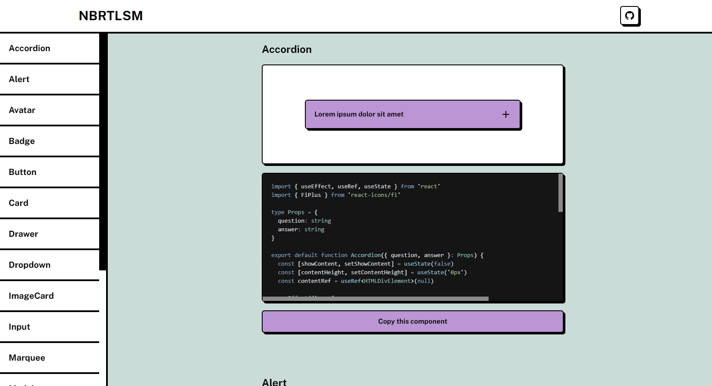

 

# Neobrutalism components

Neobrutalism components is a collection of type-safe components written in React and Tailwind.

I created this collection of components for people who want to learn more about neobrutalism.

Inspired by [ui-snippets](https://ui.ibelick.com/)
