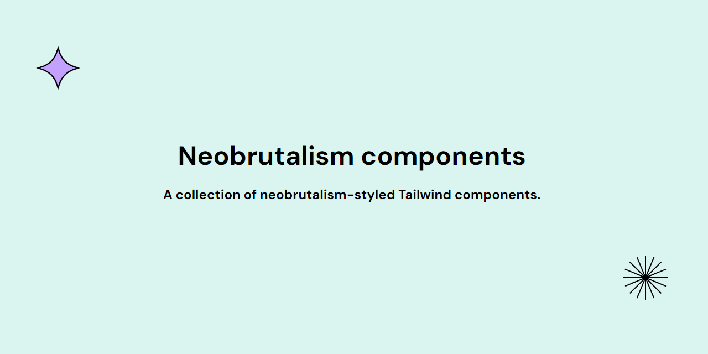

# Neobrutalism components

## Introduction

Neobrutalism components are a collection of neobrutalism-styled components based on shadcn/ui. 

## Documentation

Visit [docs](https://www.neobrutalism.dev/docs) to get started.

## About 

I created this collection of components for people who want to learn more about neobrutalism style and to help them get started with creating neobrutalism layouts.

## License

[MIT](https://github.com/ekmas/neobrutalism-components/blob/main/LICENSE)
